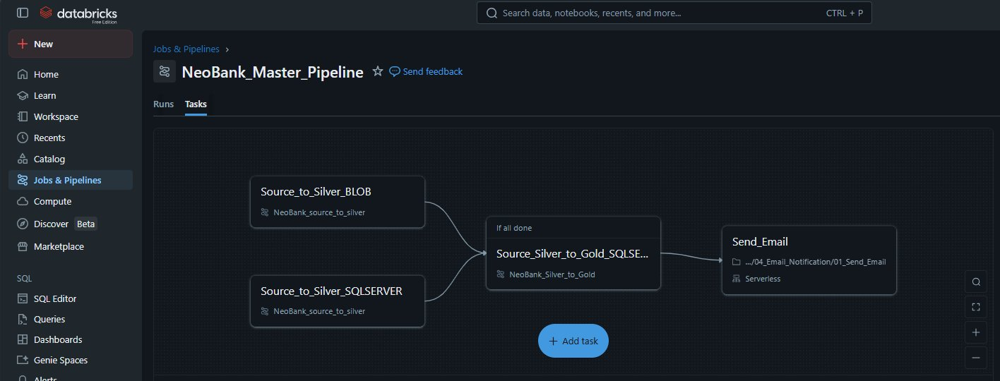
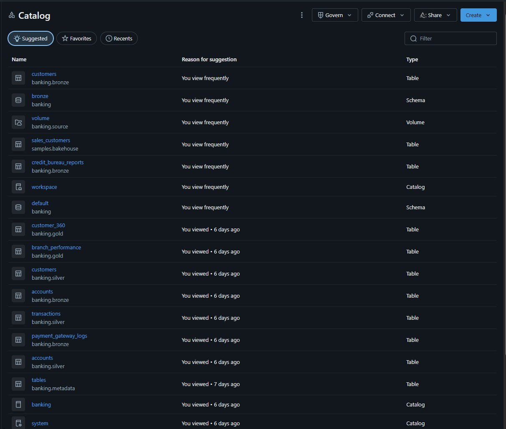
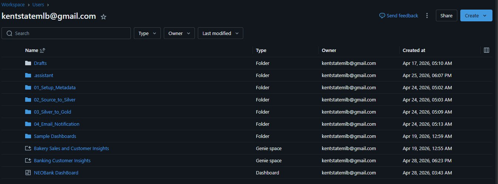
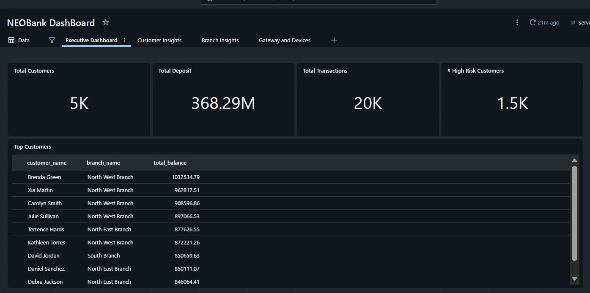
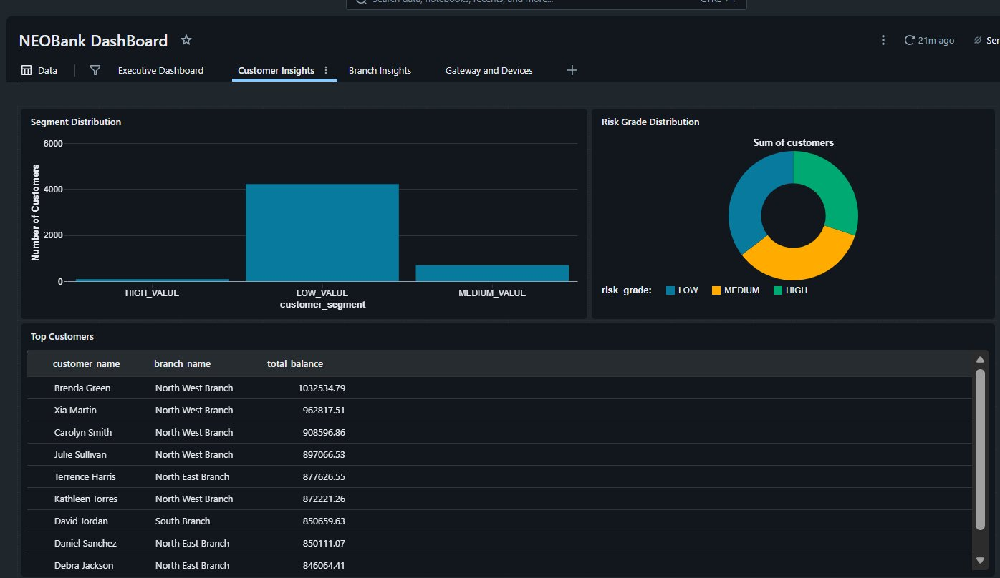
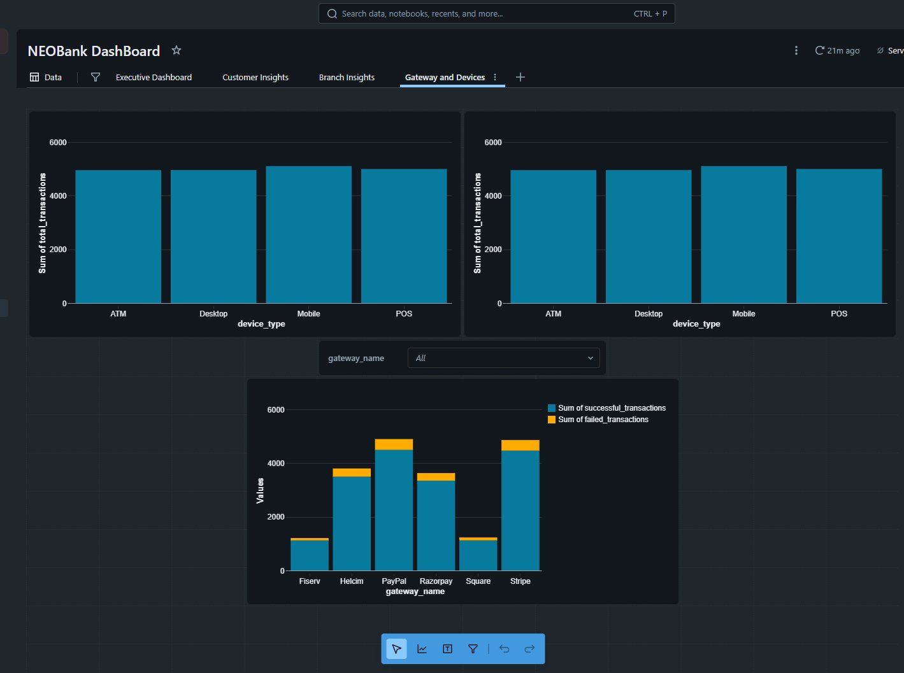
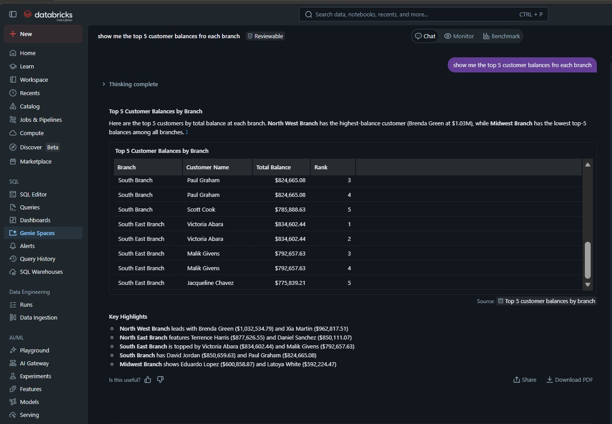
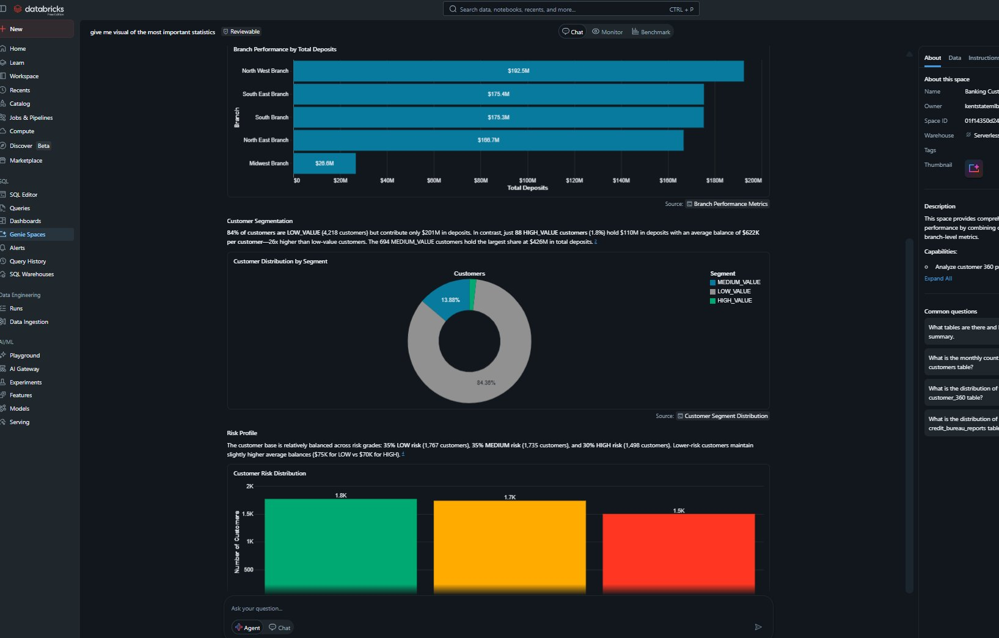

# 🏦 NeoBank Databricks Data Engineering Project

A production-style **Medallion Architecture** data pipeline built on **Databricks** and **Delta Lake**, ingesting banking data from SQL Server and Azure Blob Storage through Bronze → Silver → Gold layers, powering a live NEOBank Dashboard and AI-driven Genie Spaces.

---

## 📐 Architecture Overview

```
SQL Server ──────────────────────────────────┐
  (customers, accounts,                       │
   transactions, branches)                    ▼
                                    ┌─────────────────┐
Azure Blob Storage ──────────────▶  │  🥉 BRONZE       │  Raw append-only Delta tables
  (credit_bureau_reports,           │  banking.bronze  │  + insert_timestamp
   payment_gateway_logs)            └────────┬────────┘
                                             │
                                    ┌────────▼────────┐
                                    │  🥈 SILVER       │  Cleansed, merged, watermarked
                                    │  banking.silver  │  FULL / APPEND / MERGE strategies
                                    └────────┬────────┘
                                             │
                                    ┌────────▼────────┐
                                    │  🥇 GOLD         │  Business aggregations
                                    │  banking.gold    │  customer_360, branch_performance,
                                    └────────┬────────┘  daily_bank_kpi, risk_summary, etc.
                                             │
                              ┌──────────────┴──────────────┐
                              │                             │
                    ┌─────────▼──────────┐     ┌───────────▼──────────┐
                    │  NEOBank Dashboard  │     │  Databricks Genie    │
                    │  (4 tabs, live KPIs)│     │  (AI-powered queries)│
                    └────────────────────┘     └──────────────────────┘
```

---

## 🗂️ Repository Structure

```
├── metadata/               # Pipeline control plane (setup, config, audit)
│   ├── 00_Setup_Secret_Scope.py
│   ├── 01_Setup_Metadata.sql
│   ├── 02_Check_Metadata.sql
│   ├── 01_Read_Tables_List.py
│   └── 02_Read_Table_Parameters.py
│
├── bronze/                 # Raw ingestion layer
│   └── 03_Source_to_Bronze.py
│
├── silver/                 # Cleansed & conformed layer
│   └── 04_Bronze_to_Silver.py
│
├── gold/                   # Business-ready analytics layer
│   ├── 01_Silver_to_Gold_Driver.py
│   ├── customer_360.py
│   ├── branch_performance.py
│   ├── transaction_channel_summary.py
│   ├── daily_bank_kpi.py
│   └── risk_customer_summary.py
│
└── images/                 # Screenshots
```

---

## 🚀 Master Pipeline (Databricks Jobs)

The pipeline is orchestrated via a **Databricks Job** called `NeoBank_Master_Pipeline` with parallel ingestion paths that converge at the Gold layer.



**Flow:**
- `Source_to_Silver_BLOB` and `Source_to_Silver_SQLSERVER` run **in parallel**
- Once both complete → `Source_Silver_to_Gold_SQLSE...` runs
- Finally → `Send_Email` notification is triggered (Serverless)

---

## ⚙️ Metadata-Driven Design

All pipeline behaviour is controlled through metadata tables — no hardcoded table names, load types, or watermarks anywhere in the processing notebooks.

| Table | Purpose |
|-------|---------|
| `banking.metadata.tables` | Registry of all 11 tables with source info and layer config |
| `banking.metadata.table_parameters` | Per-table load_type, primary_key, watermark_column |
| `banking.metadata.table_watermarks` | Last processed watermark per incremental table |
| `banking.metadata.pipeline_runs` | Full audit log: status, record counts, errors, timestamps |

---

## 🥉 Bronze Layer

Raw data lands in `banking.bronze.*` with zero transformations — only `insert_timestamp` is added. SQL Server data is read via JDBC; Blob CSV files use **Auto Loader** with schema inference.

> 📁 See [`bronze/README.md`](bronze/README.md) for full details.

---

## 🥈 Silver Layer

Bronze data is promoted to `banking.silver.*` using one of three strategies:

| Strategy | Tables |
|----------|--------|
| **MERGE** (upsert by PK) | customers, accounts, credit_bureau_reports |
| **APPEND** (new records only) | transactions, payment_gateway_logs |
| **FULL** (complete overwrite) | branches |

Watermarks are updated after each successful run. Audit records track every execution.

> 📁 See [`silver/README.md`](silver/README.md) for full details.

---

## 🥇 Gold Layer

Five business-ready tables are built from Silver joins and aggregations:

| Table | Description |
|-------|-------------|
| `customer_360` | Full customer profile with balances, transactions, credit score & segment |
| `branch_performance` | Branch KPIs: deposits, customers, transaction volume |
| `transaction_channel_summary` | Daily gateway & device success/failure rates |
| `daily_bank_kpi` | Bank-wide daily snapshot |
| `risk_customer_summary` | Risk tier breakdown with loan exposure |

**Customer Segmentation:**
- 🟢 `HIGH_VALUE` — balance ≥ $500K
- 🟡 `MEDIUM_VALUE` — balance ≥ $100K
- 🔴 `LOW_VALUE` — balance < $100K

> 📁 See [`gold/README.md`](gold/README.md) for full details.

---

## 🗃️ Databricks Catalog

All tables are registered in the `banking` Unity Catalog across schemas: `bronze`, `silver`, `gold`, `metadata`, and `source`.



---

## 📁 Workspace Structure



Notebooks are organized into four folders:
- `01_Setup_Metadata` — one-time setup
- `02_Source_to_Silver` — ingestion pipeline
- `03_Silver_to_Gold` — transformation pipeline
- `04_Email_Notification` — alerting

---

## 📊 NEOBank Dashboard

A multi-tab Databricks Dashboard powered by Gold layer tables.

### Executive Dashboard
High-level KPIs: 5K customers, $368M deposits, 20K transactions, 1.5K high-risk customers.



### Customer Insights
Segment distribution and risk grade breakdown.



### Gateway and Devices
Transaction volume and success/failure rates by payment gateway (Stripe, PayPal, Fiserv, etc.) and device type (ATM, Mobile, Desktop, POS).



---

## 🤖 Databricks Genie Spaces

AI-powered natural language querying over Gold tables. Ask questions like *"show me the top 5 customer balances for each branch"* and get instant SQL-backed results.





---

## 🔐 Secrets Management

SQL Server credentials are stored securely in a **Databricks Secret Scope** (`banking-scope`) as a JSON object. The pipeline retrieves them at runtime — no credentials in code.

```python
secret_json = dbutils.secrets.get(scope="banking-scope", key="sqlserver-connection-json")
config = json.loads(secret_json)
```

---

## 🛠️ Setup Instructions

### 1. Configure Secrets
Run `metadata/00_Setup_Secret_Scope.py` after filling in your SQL Server host, database, and credentials.

### 2. Initialize Metadata
Run `metadata/01_Setup_Metadata.sql` to create all Delta metadata tables and insert the table registry.

### 3. Deploy Notebooks
Upload the `bronze/`, `silver/`, and `gold/` notebooks to your Databricks workspace under the corresponding folders.

### 4. Create the Job
Set up the `NeoBank_Master_Pipeline` Databricks Job with:
- Parallel tasks for BLOB and SQL Server ingestion
- Silver-to-Gold task dependent on both
- Email notification task on completion

### 5. Run
Trigger the job manually or schedule it. Monitor progress in `banking.metadata.pipeline_runs`.

---

## 📦 Tech Stack

| Component | Technology |
|-----------|-----------|
| Platform | Databricks (Free Edition) |
| Storage | Delta Lake |
| Catalog | Unity Catalog |
| Sources | SQL Server (JDBC), Azure Blob Storage |
| Ingestion | Spark, Auto Loader |
| Orchestration | Databricks Jobs |
| Secrets | Databricks Secret Scopes |
| Dashboards | Databricks Dashboards |
| AI Queries | Databricks Genie Spaces |
